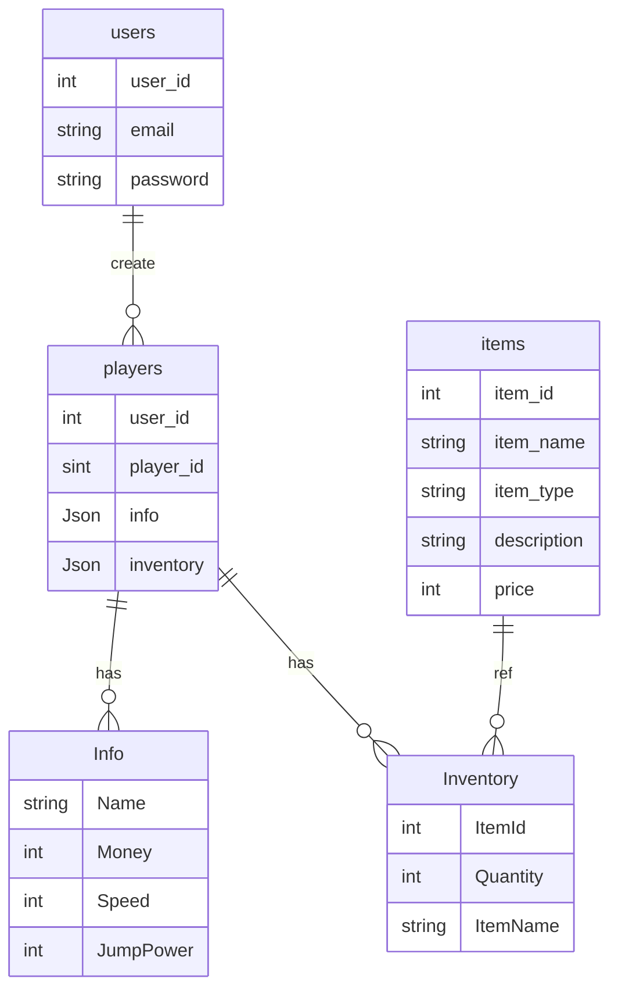
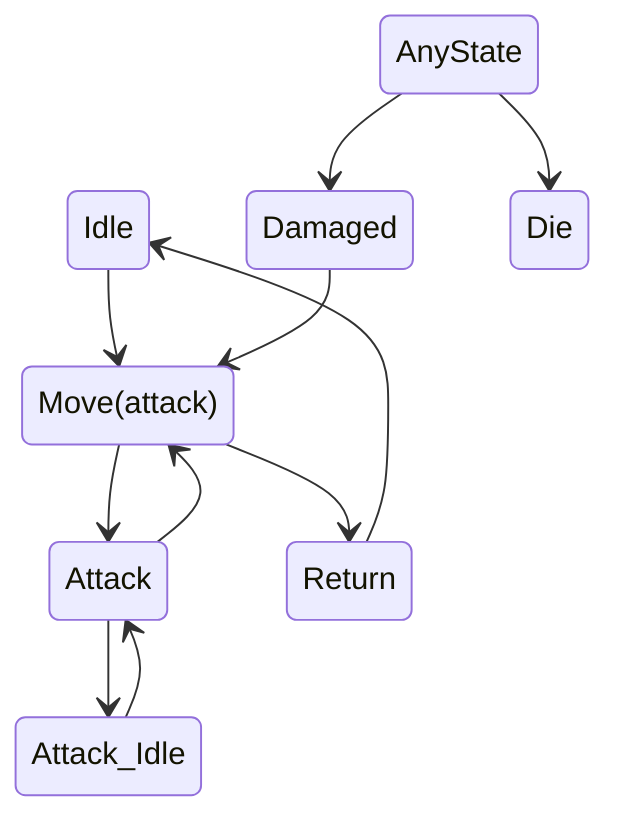

# 포트폴리오 ( Gameworld )

 

### 프로젝트 소개

- GameWorld는 1인 프로젝트로 개발된 3D 게임으로, 게임 내에서 다양한 미니 게임을 즐길 수 있도록 개발하였습니다.   데이터는 HTTP 통신을 통해 서버의 데이터베이스에서 불러오고 저장할 수 있도록 하여, 플레이어가 게임 진행 상황을 저장하고 불러올 수 있도록 하였습니다
- Socket 프로그래밍을 통해 멀티 플레이를 위한 오브젝드 동기화 및 채팅 기능을 구현하였습니다.

 

### 개발 기간

2024.07.03 ~ 2024.07.18 ( 유니티 개발 )  
2024.08.03 ~ 2024.08.10 ( 멀티 플레이 프로그래밍 )

 

### 개발 도구

- Unity
- Mysql
- Gin 프레임워크
- Socket(Golang)

 

### 게임 영상

- 게임 개발 기간 동안 구현한 내용을 녹화한 게임 영상을 준비했습니다. 이 영상에는 프로젝트의 기능과 미니 게임을 포함하여 여러 게임 요소들을 보여주고 있습니다. 엘든링에서 영감을 받은 3인칭 시점과 미니 보스 전투 장면을 포함하여, 전반적인 게임 흐름이 담겨있습니다. 또한, HTTP 통신을 통해 서버와
  데이터를 주고받는 기능도 확인할 수 있습니다.[녹화 영상 보러가기 ( 유니티 개발 )](https://youtu.be/BEdotAtLT_I)
- 채팅 기능과 오브젝트 동기화 기능을 구현한 녹화 영상입니다.[녹화 영상 보러가기 ( 멀티 플레이 프로그래밍 )](https://youtu.be/39iLTVC7uGQ)

 

### 개발 자료

- #### 네트워크 프로그래밍
  **채팅 서버 구현**: 소켓 프로그래밍을 활용하여 채팅 서버를 구현했습니다. 배포 시 유지 보수와 확장을 용이하게 하기 위해 독립적으로 서버를 구현했습니다.
  https://github.com/Jaeun-Choi98/network-project/tree/main/Go/ChatProgram 
   
  **오브젝트 동기화 서버 구현**: 소켓을 활용한 멀티 플레이 서버 구현
  https://github.com/Jaeun-Choi98/network-project/tree/main/Go/MultiplayerSyncProgram/Server

 
 

- #### DB 스키마

게임을 개발하면서 설계한 DB 구조입니다. Info 테이블과 Inventory 테이블은 이후 개발 과정에서 수정 사항을 편리하게 관리하기 위해 JSON 타입으로 데이터를 저장하도록 설계하였습니다.

 
 

- #### Boss FSM전이

보스 상태 전이도입니다. 각 상태는 독립적으로 관리됩니다.

