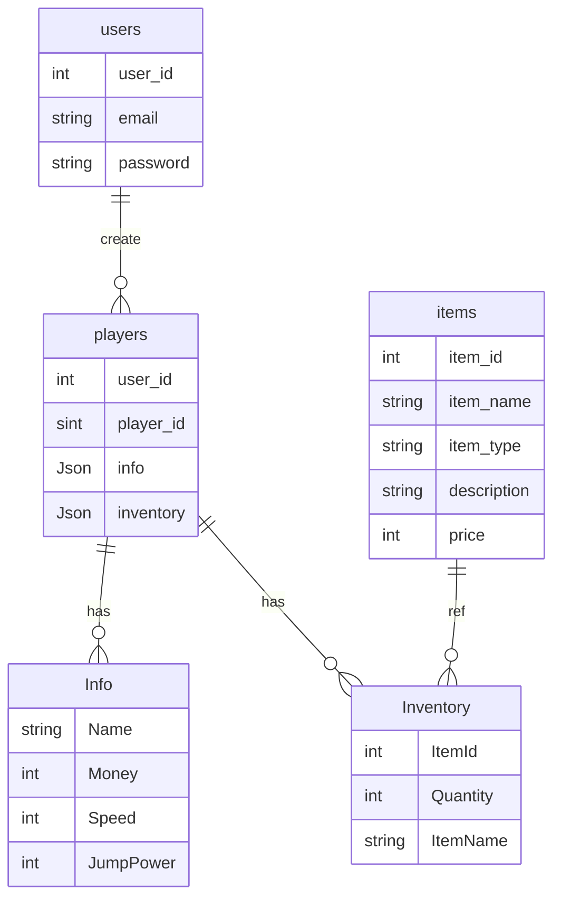
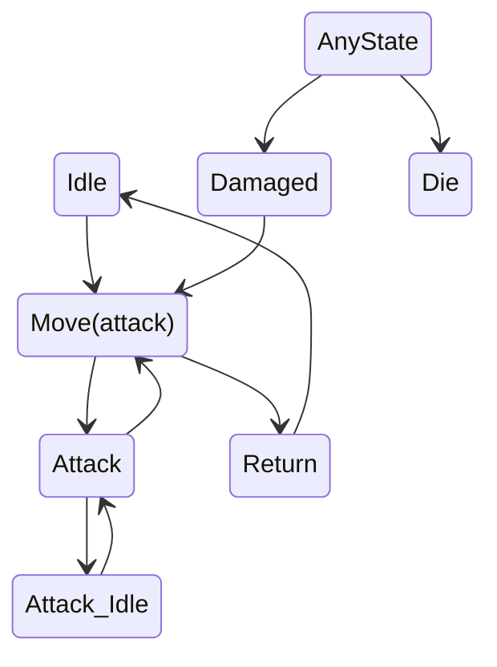

# GameWorld

 
 

## 프로젝트 소개

**GameWorld**는 1인 개발로 완성된 3D 게임으로, 다양한 미니 게임과 멀티플레이 기능을 제공하는 프로젝트입니다. 이 게임은 HTTP 통신과 소켓 프로그래밍을 활용하여 플레이어 경험을 확장하고, 데이터 저장 및 동기화 기능을 구현했습니다.

### 주요 기능

- **싱글 플레이**: 다양한 미니 게임과 보스 전투를 포함한 3인칭 시점의 게임플레이.
- **데이터 저장 및 불러오기**: HTTP 통신을 통해 서버 데이터베이스와 연결하여 게임 진행 상황 저장 및 로드.
- **멀티플레이**:
  - 소켓 프로그래밍을 활용한 실시간 오브젝트 동기화.
  - 채팅 서버를 통한 플레이어 간 실시간 소통.

 

## 개발 기간

- **Unity 개발**: 2024.07.03 \~ 2024.07.18
- **멀티플레이 프로그래밍**: 2024.08.03 \~ 2024.08.10

 

## 개발 도구

- **게임 엔진**: Unity
- **데이터베이스**: MySQL
- **백엔드 프레임워크**: Gin (Golang)
- **네트워크 프로그래밍**: Socket (Golang)

 

## 시연 영상

- **Unity 개발**:

  - 게임 내 주요 기능과 미니 게임, 보스 전투를 포함한 3인칭 게임플레이.
  - HTTP 통신을 활용한 서버와의 데이터 주고받기 기능.
  - [녹화 영상 보러가기](https://youtu.be/BEdotAtLT_I)

- **멀티플레이 프로그래밍**:

  - 실시간 오브젝트 동기화 및 채팅 기능 구현.
  - [녹화 영상 보러가기](https://youtu.be/39iLTVC7uGQ)

 

## 관련 자료

- **네트워크 프로그래밍**:

  - 채팅 서버 구현: 소켓 프로그래밍을 활용하여 독립적으로 구현한 채팅 서버.
    - [소스 코드 보기](https://github.com/Jaeun-Choi98/network-project/tree/main/Go/ChatProgram)
  - 오브젝트 동기화 서버 구현: 소켓을 활용한 멀티플레이 서버.
    - [소스 코드 보기](https://github.com/Jaeun-Choi98/network-project/tree/main/Go/MultiplayerSyncProgram/Server)

 

- **DB 스키마**

게임을 개발하면서 설계한 DB 구조입니다. Info 테이블과 Inventory 테이블은 이후 개발 과정에서 수정 사항을 편리하게 관리하기 위해 JSON 타입으로 데이터를 저장하도록 설계하였습니다.

```mermaid
erDiagram
    users ||--o{ players: create
    users {
        int user_id
        string email
        string password
    }
    players {
        int user_id
        sint player_id
        Json info
        Json inventory
    }
    players ||--o{ Info: has
    players ||--o{ Inventory: has
    items ||--o{ Inventory: ref
    items {
        int item_id
        string item_name
        string item_type
        string description
        int price
    }
    Info {
        string Name
        int Money
        int Speed
        int JumpPower
    }
    Inventory {
        int ItemId
        int Quantity
        string ItemName
    }
```

 

- **Boss FSM전이**

보스 상태 전이도입니다. 각 상태는 독립적으로 관리됩니다.

```mermaid
stateDiagram-v2
    Idle --> Move(attack)
    Move(attack) --> Attack
    Attack --> Move(attack)
    Attack --> Attack_Idle
    Attack_Idle --> Attack
    Move(attack) --> Return
    Return --> Idle

    AnyState --> Damaged
    Damaged --> Move(attack)
    AnyState --> Die
```
